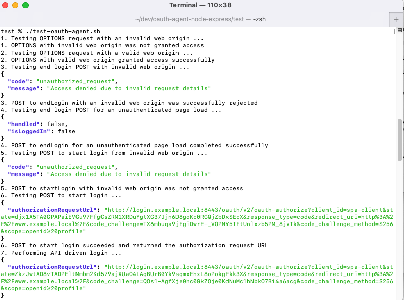

# How to Run the OAuth Agent Locally

Follow the below steps to get set up for developing and testing the OAuth Agent itself. This instruction will show you \
how to set up the OAuth Agent together with an instance of the Curity Identity Server used as the Authorization Server.

## Prerequisites

Ensure that these tools are installed locally:

- [Java 17 or later](https://openjdk.java.net/projects/jdk/17/)
- [Docker Desktop](https://www.docker.com/products/docker-desktop)
- [jq](https://stedolan.github.io/jq/download/)

Get a community edition license file for the Curity Identity Server.

## Update your Hosts File

Ensure that the hosts file contains the following development domain names:

```text
127.0.0.1  api.example.local login.example.local
:1 localhost
```

## Understand URLs

For local development of the OAuth Agent the following URLs are used:

| Component | Base URL | Usage                                                     |
| --------- | -------- |-----------------------------------------------------------|
| OAuth Agent | http://api.example.local:8080/oauth-agent | This will act as a modern Back End for Front End for SPAs |
| Curity Identity Server | http://login.example.local:8443 | This will receive a client secret from the OAuth Agent   | 

## Build and Run the OAuth Agent

Run this command from the root folder and the API will then listen on SSL over port 8080.\
Alternatively the API can be run in an IDE of your choice:

```bash
./gradlew bootRun
```

Test that the API is contactable by running this command from the root folder:

```bash
curl -X POST http://api.example.local:8080/oauth-agent/login/start \
-H "origin: http://www.example.local" | jq
```

## Run Integration Tests

You can run Spock integration tests with the following command, which spin up an instance of the API.\
Integration tests use Wiremock to mock responses from the Curity Identity Server and do not \
need any external dependencies.

```bash
./gradlew test --rerun-tasks
```

## Run End-to-End Tests

Run some tests that also use the Curity Identity Server.\
First copy a license file into the `test/idsvr` folder and then run the following commands:

```bash
./test/idsvr/deploy.sh
```

Then run a test script that uses curl requests to verify the OAuth Agent's operations:

```bash
./test/test-oauth-agent.sh
```



## Free Docker Resources

When finished with your development session, free Docker resources like this:

```bash
./test/idsvr/teardown.sh
```
